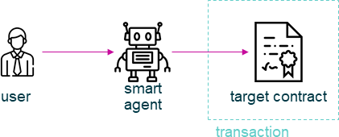

================================================================================
ExecutorAgent
================================================================================

.. list-table:: 
   :widths: auto
   :stub-columns: 1

   * - Class Name
     - ExecutorAgent
   * - Extends
     - `Executor <../blockchain/executor.html>`_
   * - Source
     - `executor-agent.ts <https://github.com/evannetwork/api-blockchain-core/tree/master/src/contracts/executor-agent.ts>`_
   * - Examples
     - `executor-agent.spec.ts <https://github.com/evannetwork/api-blockchain-core/tree/master/src/contracts/executor-agent.spec.ts>`_

The ``ExecutorAgent`` module is designed to cover basically the same tasks as the `Executor <../blockchain/executor.html>`_ module. While the last one performs the transactions directly with an account or identity, that is given as inputOptions, the ``ExecutorAgent`` module wraps those transactions by submitting them to a smart agent.

The smart agent receives those transactions and performs them with its own account or identity, if a valid tokens has been passed to it alongside the transaction data. Tokens for transactions can be issued at the smart agent as well (a password is required for this).

Using the ``ExecutorAgent`` allows to delegate transactions to users that do not have their own blockchain accounts or identities. Delegating those transactions requires that smart agent user to be invited into the contract instead of the users, that will interact with the contract.

Users without accounts or identities are then interacting with the front-end the same way as regular users, but do not submit their transactions themselves, they make a REST request against a smart agent server. To prevent spamming and scamming, the users use tokens for their transactions. Tokens are basically like prepaid telephone card and allows to perform a limited set of functions for a limited amount of times. Tokens can only be created with a valid password.

Let's say, we have created a `DataContract <https://github.com/evannetwork/api-blockchain-core/tree/master/src/contracts/data-contract/data-contract.ts>`_, that contains three questions, that should be answered by someone without an own blockchain account or identity (think of a customer survey or something similar).

To allow that, first invite the corresponding smart agent account or identity into the contract. Smart agent accounts or identities for this should be known to the party, that wants to delegate transactions and their funds are maintained by this party, we'll use an example address for this here.

For abbreviation we assume, we have the following values:

.. code-block:: typescript

  let dataContractInstance;                     // our data contract with the survey questions
  let contractOwner;                            // 'we' - the contract creator and owner
  let businessCenterDomain = 'testbc.evan';     // contracts business center
  let smartAgentId;                             // account id of our smart agent
  let password;                                 // password, for token generation

So let's invite the smart agent to our contract:

.. code-block:: typescript

    await dataContract.inviteToContract(
      businessCenterDomain,
      dataContractInstance.options.address,
      contractOwner,
      smartAgentId,
    );

Now with the smart agent being able to perform transactions, create a token for transaction delegation. We want the user to be able to:

#. accept the invitation
#. write three answers
#. mark their state as "done"

.. code-block:: typescript

  const txToken = await executor.generateToken(
    password, [
    { contract: dataContractInstance, functionName: 'changeConsumerState', count: 2, },
    { contract: dataContractInstance, functionName: 'addListEntry', count: 3, },
  ]);

Allowing ``addListEntry`` three time is to allow them to write three answers. One of the ``changeConsumerState`` times is for accepting the contract, which is done by setting the own state to ``Active``. The other one is for marking editing as done (setting the own state to ``Terminated``).

The resulting token ``txToken`` is a string, that can be handed over to our users without an account or or identity. This is usually done by sending them an email with a link, that contains the token and skips the login step for them and routes them directly to the contract, they should respond to.

Let's switch sides. The next steps are performed in the front-end by a user without a blockchain account or identity, that has received the token.

To make transaction via a smart agent, create an instance of the ``ExecutorWallet`` and assign the token from before as ``token`` .

.. code-block:: typescript
  
  const executor = new ExecutorAgent({
    agentUrl
    config,
    eventHub,
    signer,
    web3
  });
  executor.token = txToken;

To use the ``ExecutorWallet`` instance created this way in your other modules, hand it over to their contstructor like instead of a normal ``Executor`` instance. Then use your modules, that have the ``ExeutorWallet`` instance like you would use them for making transactions with your own account or identity.

.. code-block:: typescript

  const surveyAnswer = {
    foo: 'sample',
    bar: 123,
  };
  await dataContract.addListEntries(dataContractInstance, ['surveyAnswers'], [sampleValue], smartAgentId);

Note, that the last sample uses the smartAgentId as the performing account or identity. Because transactions are estimated before being executed and in some cases the underlying modules require an "active" account or identity, that is used as the users identity, this has to match the smart agents account id. The smart agent account id is passed alongside the token via the link in the email for users wihtout blockchain accounts or identities. References, that would point to a users account or identity have to be replaced with this smart agent account id or identity.

   transaction flow in agent based transactions

.. _executor_agent_constructor:

constructor
================================================================================

.. code-block:: typescript

  new ExecutorAgent(options);

Creates a new ExecutorAgent instance.

The ExecutorAgent allows to pass the ``defaultOptions`` property to its constructor. This property contains options for transactions and calls, that will be used if no other properties are provided in calls/transactions. Explicitly passed options always overwrite default options.

----------
Parameters
----------

#. ``options`` - ``ExecutorAgentOptions``: options for ServiceContract constructor.
    * ``config`` - ``any``: configuration object for the executor instance
    * ``defaultOptions`` - ``any`` (optional): default options for web3 transactions/calls
    * ``eventHub`` - |source eventHub|_: |source eventHub|_ instance
    * ``signer`` - |source signerInterface|_: |source signerInterface|_ instance
    * ``web3`` - |source web3|_: |source web3|_ instance
    * ``agentUrl`` - ``string`` (optional): agent url, including protocol, host and port, defaults to ``'http://localhost:8080'``
    * ``log`` - ``Function`` (optional): function to use for logging: ``(message, level) => {...}``
    * ``logLevel`` - |source logLevel|_ (optional): messages with this level will be logged with ``log``
    * ``logLog`` - |source logLogInterface|_ (optional): container for collecting log messages
    * ``logLogLevel`` - |source logLevel|_ (optional): messages with this level will be pushed to ``logLog``

-------
Returns
-------

``ExecutorAgent`` instance

-------
Example
-------

.. code-block:: typescript
  
  const executor = new ExecutorAgent({
      agentUrl
      config,
      eventHub,
      signer,
      web3
    });

--------------------------------------------------------------------------------

.. _executor_agent_init:

init
===================

.. code-block:: javascript

    executor.init(name);

initialize executor

----------
Parameters
----------

#. ``options`` - ``any``: object with the property "eventHub" (of the type EventHub)
    * ``eventHub`` - ``EventHub``: The initialized EventHub Module.

-------
Returns
-------

``void``.

-------
Example
-------

.. code-block:: javascript

    runtime.executor.init({eventHub: runtime.eventHub})

------------------------------------------------------------------------------

.. _executor_agent_executeContractCall:

executeContractCall
===================

.. code-block:: javascript

    executor.executeContractCall(contract, functionName, ...args);

run the given call from contract

this is done as a rest call against the smart agent

a token is not required for performing calls

----------
Parameters
----------

#. ``contract`` - ``any``: the target contract
#. ``functionName`` - ``string``: name of the contract function to call
#. ``...args`` - ``any[]``: optional array of arguments for contract call. if last arguments is {Object}, it is used as the options parameter

-------
Returns
-------

``Promise`` resolves to ``any``: contract calls result.

-------
Example
-------

.. code-block:: javascript

    const greetingMessage = await runtime.executor.executeContractCall(
      contract,                               // web3.js contract instance
      'greet'                                 // function name
    );

------------------------------------------------------------------------------

.. _executor_agent_executeContractTransaction:

executeContractTransaction
==========================

.. code-block:: javascript

    executor.executeContractTransaction(contract, functionName, inputOptions, ...functionArguments);

execute a transaction against the blockchain, handle gas exceeded and return values from contract function

this is done as a rest call against the smart agent

transactions, that transfer EVEs to a target account or identity, will be rejected

this requires a valid token issued with ``generateToken`` beforehand, tokens can be set at the executor with:

.. code-block:: javascript

  executor.token = someToken;

----------
Parameters
----------

#. ``contract`` - ``any``: contract instance
#. ``functionName`` - ``string``: name of the contract function to call
#. ``inputOptions`` - ``any``: options object
    * ``from`` - ``string`` (optional): The address the call "transaction" should be made from.
    * ``gas`` - ``number`` (optional): The amount of gas provided with the transaction.
    * ``event`` - ``string`` (optional): The event to wait for a result of the transaction, 
    * ``getEventResult`` - ``function`` (optional): callback function which will be called when the event is triggered.
    * ``eventTimeout`` - ``number`` (optional): timeout (in ms) to wait for a event result before the transaction is marked as error
    * ``estimate`` - ``boolean`` (optional): Should the amount of gas be estimated for the transaction (overwrites ``gas`` parameter)
    * ``force`` - ``string`` (optional): Forces the transaction to be executed. Ignores estimation errors
    * ``autoGas`` - ``number`` (optional): enables autoGas 1.1 ==> adds 10% to estimated gas costs. value capped to current block.
#. ``...functionArguments`` - ``any[]``: optional arguments to pass to contract transaction

-------
Returns
-------

``Promise`` resolves to: ``no result`` (if no event to watch was given), ``the event`` (if event but no getEventResult was given), ``the`` value returned by getEventResult(eventObject).

Because an estimation is performed, even if a fixed gas cost has been set, failing transactions are rejected before being executed. This protects users from executing transactions, that consume all provided gas and fail, which is usually not intended, especially if a large amount of gas has been provided. To prevent this behavior for any reason, add a ``force: true`` to the options, though it is **not advised to do so**.

To allow to retrieve the result of a transaction, events can be used to receive values from a transaction. If an event is provided, the transaction will only be fulfilled, if the event is triggered. To use this option, the executor needs to have the ``eventHub`` property has to be set. Transactions, that contain event related options and are passed to an executor without an ``eventHub`` will be rejected immediately.

-------
Example
-------

.. code-block:: javascript

    const accountId = '0x...';
    const greetingMessage = await runtime.executor.executeContractTransaction(
      contract,                               // web3.js contract instance
      'setData',                              // function name
      { from: accountId, },                   // perform transaction with this account
      123,                                    // arguments after the options are passed to the contract
    );

Provided gas is estimated automatically with a fault tolerance of 10% and then used as `gas` limit in the transaction. For a different behavior, set `autoGas` in the transaction options:

.. code-block:: javascript

    const greetingMessage = await runtime.executor.executeContractTransaction(
      contract,                               // web3.js contract instance
      'setData',                              // function name
      { from: accountId, autoGas: 1.05, },    // 5% fault tolerance
      123,                                    // arguments after the options are passed to the contract
    );

or set a fixed gas limit:

.. code-block:: javascript

    const greetingMessage = await runtime.executor.executeContractTransaction(
      contract,                               // web3.js contract instance
      'setData',                              // function name
      { from: accountId, gas: 100000, },      // fixed gas limit
      123,                                    // arguments after the options are passed to the contract
    );

Using events for getting return values:

.. code-block:: javascript

    const contractId = await runtime.executor.executeContractTransaction(
      factory,
      'createContract', {
        from: accountId,
        autoGas: 1.1,
        event: { target: 'FactoryInterface', eventName: 'ContractCreated', },
        getEventResult: (event, args) => args.newAddress,
      },
    );

------------------------------------------------------------------------------

.. _executor_agent_executeSend:

executeSend
===================

.. code-block:: javascript

    executor.executeSend(options);

**creating contracts directly is not supported by the walled based executor, use a regular Executor for such tasks**

------------------------------------------------------------------------------

.. _executor_agent_createContract:

createContract
===================

.. code-block:: javascript

    executor.createContract(contractName, functionArguments, options);

creates a contract by contstructing creation transaction and signing it with private key of options.from

this is done as a rest call against the smart agent

transactions, that transfer EVEs to a target account or identity, will be rejected

this requires a valid token issued with ``generateToken`` beforehand, tokens can be set at the executor with:

.. code-block:: javascript

  executor.token = someToken;

----------
Parameters
----------

#. ``contractName`` - ``string``: contract name (must be available withing contract loader module)
#. ``functionArguments`` - ``any[]``: arguments for contract creation, pass empty Array if no arguments
#. ``options`` - ``any``: options object
    * ``from`` - ``string``: The address the call "transaction" should be made from.
    * ``gas`` - ``number``: Provided gas amout for contract creation.

-------
Returns
-------

``Promise`` resolves to ``any``: new contract.

-------
Example
-------

.. code-block:: javascript

    const newContractAddress = await runtime.executor.createContract(
      'Greeter',                              // contract name
      ['I am a demo greeter! :3'],            // constructor arguments
      { from: '0x...', gas: 100000, },        // gas has to be provided with a fixed value
    );

--------------------------------------------------------------------------------

.. _executor_agent_generateToken:

generateToken
================================================================================

.. code-block:: typescript

  executor.generateToken(password, functions);

generate a new token for transactions (or contract creations)

this generates a new token for the given functions, this token can be used for each requested function (either only once or multiple times, if a count > 1 has been requested)

----------
Parameters
----------

#. ``password`` - ``string``: password for token creation
#. ``functions`` - ``any[]``: array of function signatures as abi objects

-------
Returns
-------

``Promise`` returns ``string``: token for given transactions

-------
Example
-------

Tokens can be created for transactions by passing the contract and the function name to it:

.. code-block:: typescript

  const txToken = await executor.generateToken(
    password, [{ contract: contract, functionName: 'addListEntry', }]);

When the token should be able to perform those transactions multiple times, pass a count alongside:

.. code-block:: typescript

  const txToken = await executor.generateToken(
    password, [{ contract: contract, functionName: 'addListEntry', count: 3, }]);

When wanting to perform a contract creation without a factory contract, this contract has to be known to the smart agent. Then the contract name can be passed as 'signature':

.. code-block:: typescript

  cosnt ccToken = await executor.generateToken(
    password, [{ signature: 'Owned', }]);

.. required for building markup
.. |source dataContract| replace:: ``DataContract``
.. _source dataContract: ../contracts/data-contract.html

.. |source eventHub| replace:: ``EventHub``
.. _source eventHub: ../blockchain/event-hub.html

.. |source logLevel| replace:: ``LogLevel``
.. _source logLevel: ../common/logger.html#loglevel

.. |source logLogInterface| replace:: ``LogLogInterface``
.. _source logLogInterface: ../common/logger.html#logloginterface

.. |source signerInterface| replace:: ``SignerInterface``
.. _source signerInterface: ../blockchain/signer-internal.html

.. |source web3| replace:: ``Web3``
.. _source web3: https://github.com/ethereum/web3.js/
