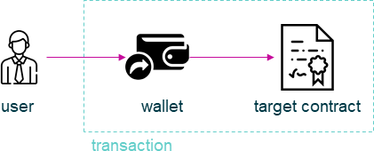

================================================================================
ExecutorWallet
================================================================================

.. list-table:: 
   :widths: auto
   :stub-columns: 1

   * - Class Name
     - ExecutorWallet
   * - Extends
     - `Executor </blockchain/executor.html>`_
   * - Source
     - `executor-wallet.ts <https://github.com/evannetwork/api-blockchain-core/tree/master/src/contracts/executor-wallet.ts>`_
   * - Tests
     - `executor-wallet.spec.ts <https://github.com/evannetwork/dbcp/tree/master/src/contracts/executor-wallet.spec.ts>`_

The ``ExecutorWallet`` module is designed to cover basically the same tasks as the |source executor|_ module. While the last one performs the transactions directly with an account, that is given as inputOptions, the ``ExecutorWallet`` module wraps those transactions by sumitting them to a configured wallet contract.

   transaction flow in wallet based transactions

The wallet is a smart contract and the account, that performs the transactions against the target contracts on the blockchain. Transactions are wrapped by using the |source wallet|_ module, see details on how to transactions are performed internally at the documentation page of the |source wallet|_ module.

Because transactions are performed via the |source wallet|_ module, they have the same limitations in regards to en- and decryption as described in the introduction section of the |source wallet|_. 

.. _executor_wallet_constructor:

constructor
================================================================================

.. code-block:: typescript

  new ExecutorWallet(options);

Creates a new ``ExecutorWallet`` instance.

The ExecutorWallet allows to pass the ``defaultOptions`` property to its constructor. This property contains options for transactions and calls, that will be used if no other properties are provided in calls/transactions. Explicitly passed options always overwrite default options.

----------
Parameters
----------

#. ``options`` - ``ExecutorWalletOptions``: options for ServiceContract constructor.
    * ``config`` - ``any``: configuration object for the executor instance
    * ``eventHub`` - |source eventHub|_: |source eventHub|_ instance
    * ``signer`` - |source signerInterface|_: |source signerInterface|_ instance
    * ``wallet`` - |source wallet|_: |source wallet|_ instance with a loaded wallet contract
    * ``web3`` - |source web3|_: |source web3|_ instance
    * ``defaultOptions`` - ``any`` (optional): default options for web3 transactions/calls
    * ``log`` - ``Function`` (optional): function to use for logging: ``(message, level) => {...}``
    * ``logLevel`` - |source logLevel|_ (optional): messages with this level will be logged with ``log``
    * ``logLog`` - |source logLogInterface|_ (optional): container for collecting log messages
    * ``logLogLevel`` - |source logLevel|_ (optional): messages with this level will be pushed to ``logLog``

-------
Returns
-------

``ExecutorWallet`` instance

-------
Example
-------

.. code-block:: typescript
  
  const executor = new ExecutorWallet({
      config,
      eventHub,
      signer,
      wallet,
      web3
    });

--------------------------------------------------------------------------------

.. _executor_wallet_init:

init
===================

.. code-block:: javascript

    executor.init(name);

initialize executor

----------
Parameters
----------

#. ``options`` - ``any``: object with the property "eventHub" (of the type EventHub)
    * ``eventHub`` - ``EventHub``: The initialized EventHub Module.

-------
Returns
-------

``void``.

-------
Example
-------

.. code-block:: javascript

    runtime.executor.init({eventHub: runtime.eventHub})

------------------------------------------------------------------------------

.. _executor_wallet_executeContractCall:

executeContractCall
===================

.. code-block:: javascript

    executor.executeContractCall(contract, functionName, ...args);

run the given call from contract

note, that if a from is used, this from is replaced with the wallets address

----------
Parameters
----------

#. ``contract`` - ``any``: the target contract
#. ``functionName`` - ``string``: name of the contract function to call
#. ``...args`` - ``any[]``: optional array of arguments for contract call. if last arguments is {Object}, it is used as the options parameter

-------
Returns
-------

``Promise`` resolves to ``any``: contract calls result.

-------
Example
-------

.. code-block:: javascript

    const greetingMessage = await runtime.executor.executeContractCall(
      contract,                               // web3.js contract instance
      'greet'                                 // function name
    );

------------------------------------------------------------------------------

.. _executor_wallet_executeContractTransaction:

executeContractTransaction
==========================

.. code-block:: javascript

    executor.executeContractTransaction(contract, functionName, inputOptions, ...functionArguments);

execute a transaction against the blockchain, handle gas exceeded and return values from contract function,

note, that a from passed to this function will be replaced with the wallets address and that transactions, that transfer EVEs to a target account, will be rejected

----------
Parameters
----------

#. ``contract`` - ``any``: contract instance
#. ``functionName`` - ``string``: name of the contract function to call
#. ``inputOptions`` - ``any``: options object
    * ``from`` - ``string`` (optional): The address the call "transaction" should be made from.
    * ``gas`` - ``number`` (optional): The amount of gas provided with the transaction.
    * ``event`` - ``string`` (optional): The event to wait for a result of the transaction, 
    * ``getEventResult`` - ``function`` (optional): callback function which will be called when the event is triggered.
    * ``eventTimeout`` - ``number`` (optional): timeout (in ms) to wait for a event result before the transaction is marked as error
    * ``estimate`` - ``boolean`` (optional): Should the amount of gas be estimated for the transaction (overwrites ``gas`` parameter)
    * ``force`` - ``string`` (optional): Forces the transaction to be executed. Ignores estimation errors
    * ``autoGas`` - ``number`` (optional): enables autoGas 1.1 ==> adds 10% to estimated gas costs. value capped to current block.
#. ``...functionArguments`` - ``any[]``: optional arguments to pass to contract transaction

-------
Returns
-------

``Promise`` resolves to: ``no result`` (if no event to watch was given), ``the event`` (if event but no getEventResult was given), ``the`` value returned by getEventResult(eventObject).

Because an estimation is performed, even if a fixed gas cost has been set, failing transactions are rejected before being executed. This protects users from executing transactions, that consume all provided gas and fail, which is usually not intended, especially if a large amount of gas has been provided. To prevent this behavior for any reason, add a ``force: true`` to the options, though it is **not advised to do so**.

To allow to retrieve the result of a transaction, events can be used to receive values from a transaction. If an event is provided, the transaction will only be fulfilled, if the event is triggered. To use this option, the executor needs to have the ``eventHub`` property has to be set. Transactions, that contain event related options and are passed to an executor without an ``eventHub`` will be rejected immediately.

-------
Example
-------

.. code-block:: javascript

    const accountId = '0x...';
    const greetingMessage = await runtime.executor.executeContractTransaction(
      contract,                               // web3.js contract instance
      'setData',                              // function name
      { from: accountId, },                   // perform transaction with this account
      123,                                    // arguments after the options are passed to the contract
    );

Provided gas is estimated automatically with a fault tolerance of 10% and then used as `gas` limit in the transaction. For a different behavior, set `autoGas` in the transaction options:

.. code-block:: javascript

    const greetingMessage = await runtime.executor.executeContractTransaction(
      contract,                               // web3.js contract instance
      'setData',                              // function name
      { from: accountId, autoGas: 1.05, },    // 5% fault tolerance
      123,                                    // arguments after the options are passed to the contract
    );

or set a fixed gas limit:

.. code-block:: javascript

    const greetingMessage = await runtime.executor.executeContractTransaction(
      contract,                               // web3.js contract instance
      'setData',                              // function name
      { from: accountId, gas: 100000, },      // fixed gas limit
      123,                                    // arguments after the options are passed to the contract
    );

Using events for getting return values:

.. code-block:: javascript

    const contractId = await runtime.executor.executeContractTransaction(
      factory,
      'createContract', {
        from: accountId,
        autoGas: 1.1,
        event: { target: 'FactoryInterface', eventName: 'ContractCreated', },
        getEventResult: (event, args) => args.newAddress,
      },
    );

------------------------------------------------------------------------------

.. _executor_wallet_executeSend:

executeSend
===================

.. code-block:: javascript

    executor.executeSend(options);

**sending funds is not supported by the walled based executor, use a regular Executor for such tasks**

------------------------------------------------------------------------------

.. _executor_wallet_createContract:

createContract
===================

.. code-block:: javascript

    executor.createContract(contractName, functionArguments, options);

**creating contracts directly is not supported by the walled based executor, use a regular Executor for such tasks**

.. required for building markup
.. |source signerInterface| replace:: ``SignerInterface``
.. _source signerInterface: /blockchain/signer.html

.. |source eventHub| replace:: ``EventHub``
.. _source eventHub: /blockchain/event-hub.html

.. |source executor| replace:: ``Executor``
.. _source executor: /blockchain/executor.html

.. |source logLevel| replace:: ``LogLevel``
.. _source logLevel: /common/logger.html#loglevel

.. |source logLogInterface| replace:: ``LogLogInterface``
.. _source logLogInterface: /common/logger.html#logloginterface

.. |source wallet| replace:: ``Wallet``
.. _source wallet: /blockchain/wallet.html

.. |source web3| replace:: ``Web3``
.. _source web3: https://github.com/ethereum/web3.js/