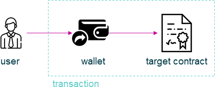

================================================================================
Wallet
================================================================================

.. list-table:: 
   :widths: auto
   :stub-columns: 1

   * - Class Name
     - Wallet
   * - Extends
     - `Logger <../common/logger.html>`_
   * - Source
     - `wallet.ts <https://github.com/evannetwork/api-blockchain-core/tree/master/src/contracts/wallet.ts>`_
   * - Examples
     - `wallet.spec.ts <https://github.com/evannetwork/api-blockchain-core/tree/master/src/contracts/wallet.spec.ts>`_

The ``Wallet`` module is a wrapper for the `MultiSigWallet <https://github.com/evannetwork/MultiSigWallet/blob/master/contracts/MultiSigWallet.sol>`_ and allows to create wallets, manage owners and execte transactions with it.
One of the common use cases is setting confirmation count to 1 (which is the default value). This basically makes the wallets a multiowned account, where all parties are able to perform transactions on their own.

The ``Wallet`` module is bound to a wallet contract instance. This instace can be loaded, which requires an existing `MultiSigWallet <https://github.com/evannetwork/MultiSigWallet/blob/master/contracts/MultiSigWallet.sol>`_ contract and a user, that is able to work with it:

.. code-block:: typescript
  
  wallet.load('0x0123456789012345678901234567890123456789');

If no wallet exists, a new wallet can be created with:

.. code-block:: typescript
  
  // account id, that creates the wallet
  const accountId = '0x0000000000000000000000000000000000000001';
  // account, that will be able to manage the new wallet
  const manager = '0x0000000000000000000000000000000000000001';
  // wallet owners
  const owners = [
    '0x0000000000000000000000000000000000000001',
    '0x0000000000000000000000000000000000000002',
  ];
  await wallet.create(accountId, manager, owners);

The last example creates a wallet

- with the account ``0x0000000000000000000000000000000000000001`` (used  as ``accountId``)
- that can be managed (adding/removing owners) by ``0x0000000000000000000000000000000000000001`` (used as ``manager``)
- that allows the accounts ``0x0000000000000000000000000000000000000001`` and  ``0x0000000000000000000000000000000000000002`` to perform transactions (used as ``owners``)

Creating wallets via the ``Wallet`` module loads them to the module as well, so there is no need to call the ``load`` function after that.

So now we have a valid and working wallet loaded to our module and start performing calls. Let's say, we have an instance of an owned contract and want to transfer its ownership, we can do:

.. code-block:: typescript

  const accountId = '0x0000000000000000000000000000000000000001';
  const newOwner = '0x0000000000000000000000000000000000000002';
  await wallet.submitTransaction(ownedContract, 'transferOwnership', { from: accountId, }, newOwner);

Looks pretty simple, but comes with a few things to consider:

- ``accountId`` is the account or identity, that performs the transaction from the "outside perspective" (if you look into a chain explorer like the `evan.network Test-Explorer <https://testexplorer.evan.network>`_ you'll see, that account or identity ``accountId`` is actually performing the transaction and not the wallet contract)
- ``accountId`` pays the gas cost for the transaction (obviously, when considering the last point)
- from the perspective of the target contract ``ownedContract``, the wallet contract (either loaded or created beforehand) is performing the transaction
- taken our example transaction ``transferOwnership``, **the wallet contract has to be the current owner** and not the account or identity ``accountId``

   transaction flow in wallet based transactions

An implementation of an |source executor|_ module, that uses a wallet for contract execution, has been created as |source executorWallet|_. Because the profiles are (externally owned) account based and many modules rely on profiles for data encryption and decryption, the |source executorWallet|_ module should be used with care, when dealing with operations, that require en- or decryption.

--------------------------------------------------------------------------------

.. _wallet_constructor:

constructor
================================================================================

.. code-block:: typescript

  new Wallet(options);

Creates a new Wallet instance.

----------
Parameters
----------

#. ``options`` - ``WalletOptions``: options for Wallet constructor.
    * ``contractLoader`` - |source contractLoader|_: |source contractLoader|_ instance
    * ``description`` - |source description|_: |source description|_ instance
    * ``eventHub`` - |source eventHub|_: |source eventHub|_ instance
    * ``executor`` - |source executor|_: |source executor|_ instance
    * ``nameResolver`` - |source nameResolver|_: |source nameResolver|_ instance

-------
Returns
-------

``Wallet`` instance

-------
Example
-------

.. code-block:: typescript
  
  const wallet = new Wallet({
    contractLoader,
    description,
    eventHub,
    executor,
    nameResolver,
  });

--------------------------------------------------------------------------------

= Contract Management =
=======================

.. _wallet_create:

create
================================================================================

.. code-block:: typescript

  wallet.create(accountId, manager, owners);

Create a new wallet contract and uses it as its wallet contract.

----------
Parameters
----------

#. ``accountId`` - ``string``: account id or identity, that creates the wallet
#. ``manager`` - ``string``: account or identity, that will be able to manage the new wallet
#. ``owners`` - ``string[]``: wallet owners
#. ``confirmations`` - ``number`` (optional): number of confirmations required to complete a transaction, defaults to ``1``

-------
Returns
-------

``Promise`` returns ``void``: resolved when done

-------
Example
-------

.. code-block:: typescript

  await wallet.create(accounts[0], accounts[0], [accounts[0]]);

--------------------------------------------------------------------------------

.. _wallet_load:

load
================================================================================

.. code-block:: typescript

  wallet.load(contractId[, walletType]);

Load wallet contract from address and uses it as its wallet contract.

----------
Parameters
----------

#. ``contractid`` - ``string``: a wallet contract address
#. ``walletType`` - ``string`` (optional): wallet contract type, defaults to ``MultiSigWallet``

-------
Returns
-------

``Promise`` returns ``void``: resolved when done

-------
Example
-------

.. code-block:: typescript

  wallet.load('0x0123456789012345678901234567890123456789');

--------------------------------------------------------------------------------

= Transactions =
======================

.. _wallet_submitTransaction:

submitTransaction
================================================================================

.. code-block:: typescript

  wallet.submitTransaction(target, functionName, inputOptions[, ...functionArguments]);

Submit a transaction to a wallet, as required is fixed to 1, this will immediately execute the transaction.

----------
Parameters
----------

#. ``target`` - ``any``: contract of the submitted transaction
#. ``functionName`` - ``string``: name of the contract function to call
#. ``inputOptions`` - ``any``: currently supported: from, gas, value, event, getEventResult, eventTimeout, estimate, force
#. ``functionArguments`` - ``any[]``: optional arguments to pass to contract transaction

-------
Returns
-------

``Promise`` returns ``any``: status information about transaction

-------
Example
-------

.. code-block:: typescript

  await wallet.submitTransaction(testContract, 'transferOwnership', { from: accounts[0], }, accounts[1]);

--------------------------------------------------------------------------------

= Account Management =
======================

.. _wallet_addOwner:

addOwner
================================================================================

.. code-block:: typescript

  wallet.addOwner(accountId, toAdd);

Function description

----------
Parameters
----------

#. ``accountId`` - ``string``: account or identity with management permissions on wallet
#. ``toAdd`` - ``string``: account or identity to add as an owner

-------
Returns
-------

``Promise`` returns ``void``: resolved when done

-------
Example
-------

.. code-block:: typescript

  await wallet.addOwner(accounts[0], accounts[1]);

--------------------------------------------------------------------------------

.. _wallet_removeOwner:

removeOwner
================================================================================

.. code-block:: typescript

  initializedModule.removeOwner(arguments);

Remove an owner from a wallet contract.

----------
Parameters
----------

#. ``accountId`` - ``string``: account or identity with management permissions on wallet
#. ``toAdd`` - ``string``: account or identity to remove from wallet owners

-------
Returns
-------

``Promise`` returns ``void``: resolved when done

-------
Example
-------

.. code-block:: typescript

  await wallet.removeOwner(accounts[0], accounts[1]);

--------------------------------------------------------------------------------

.. _wallet_getOwners:

getOwners
================================================================================

.. code-block:: typescript

  wallet.getOwners();

Get all owners of a wallet.

----------
Parameters
----------

(none)

-------
Returns
-------

``Promise`` returns ``string[]``: array of account ids or identities

-------
Example
-------

.. code-block:: typescript

  console.dir(await wallet.getOwners())
  // Output:
  // [ '0x0123456789012345678901234567890123456789' ]

.. required for building markup
.. |source contractLoader| replace:: ``ContractLoader``
.. _source contractLoader: ../contracts/contract-loader.html

.. |source description| replace:: ``Description``
.. _source description: ../blockchain/description.html

.. |source eventHub| replace:: ``EventHub``
.. _source eventHub: ../blockchain/event-hub.html

.. |source executor| replace:: ``Executor``
.. _source executor: ../blockchain/executor.html

.. |source executorWallet| replace:: ``ExecutorWallet``
.. _source executorWallet: ../blockchain/executor-wallet.html

.. |source logLevel| replace:: ``LogLevel``
.. _source logLevel: ../common/logger.html#loglevel

.. |source logLogInterface| replace:: ``LogLogInterface``
.. _source logLogInterface: ../common/logger.html#logloginterface

.. |source nameResolver| replace:: ``NameResolver``
.. _source nameResolver: ../blockchain/name-resolver.html
