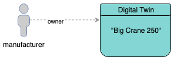
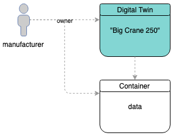
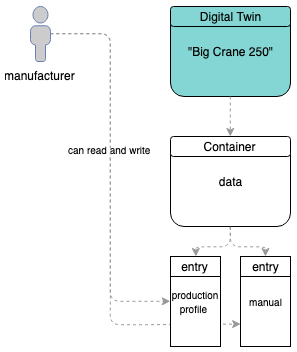
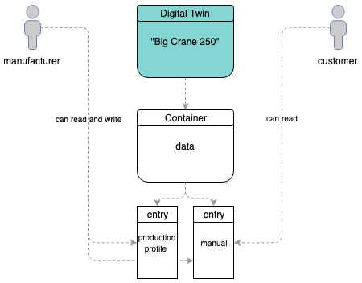
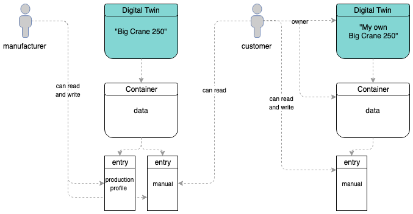
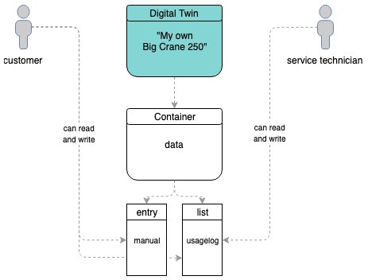

===============================
Digital Twin Usage Examples
===============================

This section shows a few usage examples that can occur in common digital twin usage scenarios and cover handling of the modules :doc:`DigitalTwin <../contracts/digital-twin>` and :doc:`Container <../contracts/container>`. The examples in here are build around the management of data for heavy construction machines and cover common events link storing data, sharing data, etc.

- *manufacturer*: original manufacturer of the heavy machine
- *customer*: a user, that has bought the physical heavy machine
- *service-technician*: hired by the *customer* to perform maintenance on the heavy machine

The examples in this section use these variables for aforementioned users:

.. code-block:: typescript

  const manufacturer = '0x0000000000000000000000000000000000000001';
  const customer = '0x0000000000000000000000000000000000000002';
  const serviceTechnician = '0x0000000000000000000000000000000000000003';

.. _create-a-digital-twin:

Create a Digital Twin
=========================

Digital Identities are collections of data related to a "thing". A "thing" can be basically anything, a bird, a plane or someone from the planet Krypton. Jokes aside, it most commonly describes a physical object - like in our example here a heavy machine.

So let's create a digital twin four our heavy machine "Big Crane 250", which is done with the |source digitalTwin_create|_ function:

.. code-block:: typescript

    const bigCrane250 = await DigitalTwin.create(runtime, { accountId: manufacturer });

This creates a new digital twin for the account ``manufacturer``, which can now add containers to it or set other properties.

The |source digitalTwin_create|_ `config` argument function supports more properties than just `accountId`.

You can **and should** give your digital twin a `DBCP <https://dbcp.online/en/home/>`_ description. To do this pass it to the new digital twin in the `config` property.

.. code-block:: typescript

    const description = {
      name: 'Big Crane 250',
      description: 'Digital Twin for my heavy machine "Big Crane 250"',
      author: 'Manufacturer',
      version: '0.1.0',
      dbcpVersion: 2,
    };
    const bigCrane250 = await DigitalTwin.create(
      runtime, { accountId: manufacturer, description });

If you do not set a description, at creation time, a default description is set. This description is available at the |source digitalTwin_defaultDescription|_ and can be used as a starting point for your own description. A description can be updated later on as well, see |source digitalTwin_setDescription|_.

So let's say, we have created a digital twin four our heavy machine with the setup from the last code example. We now have the following setup:

   manufacturer created a digital twin

--------------------------------------------------------------------------------

.. _add-containers:

Add Containers to Digital Twin
==================================

Continuing with the digital twin from the last section we add a container, that holds manufacturers private data with information about the production process and a link to a manual file. This can be done with the |source digitalTwin_createContainers|_ function:

.. code-block:: typescript

  const { data } = await bigCrane250.createContainers({
    data: {},
  });

The manufacturer account now has created a :doc:`Container <../contracts/container>` instance called ``data``. This can be customized as described at |source container_create|_.

   manufacturer added a container to the twin

--------------------------------------------------------------------------------

.. _add-data:

Add Data to the Container
=========================

Continuing the example, the manufacturer adds data to the container.

.. code-block:: typescript

  await data.setEntry(
    'productionProfile',
    {
      id: 'BC250-4711',
      dateOfManufacturing: '1554458858126',
      category: 'hem-c',
    },
  );
  await data.setEntry('manual', 'https://a-link-the-manual...');

As these properties are new, |source container_setEntry|_ adds a role for each property and the owner of the digital twin joins this role. During this role ``0`` to ``63`` are skipped as they are system reserved and can be used for more complex contract role setups. So the roles ``64`` (for ``productionProfile``) and ``65`` (for ``manual``) are created.

For each new property a new encryption key is generated and stored in the contracts :doc:`Sharings <../contracts/sharing>`. When new properties are added, this key is only shared for the owner of the digital twin, so only the owner can access the data stored in the contract.

Data can be read from the containers with |source container_getEntry|_:

.. code-block:: typescript

  const productionProfile = await data.getEntry('productionProfile');

   manufacturer added entries to the container

--------------------------------------------------------------------------------

.. _share-container-properties:

Share Container Properties
==========================

As already said, the manufacturer wants to keep production data for own usage and share a link to the manual to the account ``customer``. When not explicitly shared, properties are kept private, so nothing to do for the field ``productionProfile``. To allow other accounts to access ``manual``, encryption keys have to be shared, which can be done with |source container_shareProperties|_:

.. code-block:: typescript

  await data.shareProperties([
    { accountId: customer, read: ['manual'] }
  ]);

With this call, the account ``customer`` is added to the role ``1`` (member), which allows basic contract interaction but not necessarily access to the data. And because ``manual`` has be specified as a ``read`` (-only) field, this account receives an encryption key for the property ``manual``, so it is now able to read data from this field.

To load data from the twins, ``customer`` can now fetch the container from the digital twin and load its data. Let's assume ``manufacturer`` has communicated the address of the digital twin (e.g. ``0x00000000000000000000000000000000000000c1``) to ``customer`` and the customer can access the link to the manual with:

.. code-block:: typescript

  const bigCrane250LoadedFromCustomer = new DigitalTwin(
    runtime, { accountId: customer, address: '0x00000000000000000000000000000000000000c1' });
  const dataLoadedFromCustomer = await bigCrane250LoadedFromCustomer.getEntry('data');
  const link = await dataLoadedFromCustomer.getEntry('manual');

   customer can read entry "manual"

--------------------------------------------------------------------------------

.. _cloning-containers:

Cloning Containers
==================

If ``customer`` wants to re-use data from a data container or an entire data container but have ownership over it, it can clone it and use it in an own digital twin contract. This can be done with |source container_clone|_:

.. code-block:: typescript

  const dataClone = await Container.clone(
    runtime, { accountId: customer }, dataLoadedFromCustomer);

This clone can be linked to a digital twin owner by ``customer``. So let's create a new one and add the clone to it:

.. code-block:: typescript

  const customersDescription = {
    name: 'My own Big Crane 250',
    description: 'I bought a Big Crane 250 and this is my collection of data for it',
    author: 'Customer',
    version: '0.1.0',
    dbcpVersion: 2,
  };
  const customersBigCrane250 = await DigitalTwin.create(
    runtime, { accountId: customer, description: customersDescription });

  await customersBigCrane250.setEntry(
    'machine-data',
    dataClone,
    DigitalTwinEntryType.Container,
  );

Note that the container is not named ``data`` like in the original twin but called ``machine-data`` here. Names can be reassigned as desired.

   customer cloned data container

--------------------------------------------------------------------------------

.. _granting-write-access:

Granting Write Access
=====================

Properties at :doc:`Containers <../contracts/container>` can be "entries" as used in the last examples or "list entries". To add data to lists call |source container_addListEntries|_:

.. code-block:: typescript

  await dataClone.addListEntries(
    'usagelog',
    [ 'I started using my new Big Crane 250' ]
  );

Now ``customer`` wants to invite ``serviceTechnician`` and allow this account to add entries to the list ``usagelog`` as well. To do this, the list is shared the same way as in the previous example, but the field is shared as ``readWrite``:

.. code-block:: typescript

  await dataClone.shareProperties([
    { accountId: customer, readWrite: ['usagelog'] }
  ]);

``serviceTechnician`` can now write to the list ``usagelog`` and we now have the following setup:

   customer invited service technician

--------------------------------------------------------------------------------

.. _granting-handling-files:

Handling Files
==============

Containers can hold files as well. File handling follows a few simple principles:

- files are stored encrypted (as everything in containers is stored encrypted)
- files are always stored as an array of files (think of it like a folder with files)
- files are encrypted, uploaded and a reference is stored as a file at the contract (sounds like the default `Hybrid Storage <https://evannetwork.github.io/docs/how_it_works/services/ipfsfilehandling.html#hybrid-storage>`_) approach, but is a reapplication to itself, as encrypted additional files with references to the original encrypted files are stored at the contract

Okay, let's add some files to a container (taken from our `tests <https://github.com/evannetwork/api-blockchain-core/blob/master/src/contracts/digital-twin/container.spec.ts>`_).

A file needs to be provided as a buffer. In NodeJs, this can be done with ``fs.readFile``

.. code-block:: typescript

  import { promisify } from 'util';
  import { readFile } from 'fs';

  const file = await promisify(readFile)(
  `${__dirname}/testfiles/animal-animal-photography-cat-96938.jpg`);

The file is expected to be wrapped in a specific container format, which is defined in the |source container_containerFile|_ interface. So let's build such a file object and store it in an object including a property called files, as files are always provided as arrays of |source container_containerFile|_ instances to the API:

.. code-block:: typescript

  const sampleFiles = {
    files:[{
      name: 'animal-animal-photography-cat-96938.jpg',
      fileType: 'image/jpeg',
      file,
    }]
  };

If not already done, create (or load) a container:

.. code-block:: typescript

  const container = await Container.create(runtime, config);

If not already done, add a field for files to our container, for this the static property ``Container.defaultTemplates`` can be useful:

.. code-block:: typescript

  await container.ensureProperty('sampleFiles', Container.defaultSchemas.filesEntry);

So now everything is set up and we can store our file:

.. code-block:: typescript

  await container.setEntry('sampleFiles', sampleFiles);

And later on we can retrieve our file with:

.. code-block:: typescript

  await container.getEntry('sampleFiles');

That's it for the simple case. If you want to get fancy, you can have a look at the more complex examples in the tests. With the build in file handling you can:

- store lists of files in an entry (this example) |br|
  test path: |source container_testEntrySimple|_
- store lists of files in complex objects (e.g. if you want to annotate them) |br|
  test path: |source container_testEntryComplex|_
- store a list of lists of files (hands up, who tripped, when reading this, *me too*, it's basically a list of directories),
  this can be used to store different versions of files or separate file groups which have no relations between them
  test path: |source container_testListSimple|_
- store a list of lists of files (a combination between lists and complex objects) |br|
  test path: |source container_testListComplex|_

--------------------------------------------------------------------------------

.. _template_plugins:

Handling Templates and Plugins
==============================

Container definitions can be saved as plugins, so they can easy be shared and the structure can be imported by anyone else. These plugins can be combined, including a dbcp description, that represents a whole twin structure, a so called **Twin Template**.

Have a look at several example twin templates in our separated `Twin Templates repository <https://github.com/evannetwork/twin-templates>`__:

- `Sample Twin Template <https://github.com/evannetwork/twin-templates/blob/master/test.json>`__.
- `Car Template <https://github.com/evannetwork/twin-templates/blob/master/car.json>`__.
- `Bicycle Template <https://github.com/evannetwork/twin-templates/blob/master/bicycle.json>`__.

**Steps to your own twin template:**

1. Define a short description of your twin template:

.. code-block:: typescript

  {
    "description": {
      "name": "Heavy Machine",
      "description": "Basic Heavy Machine twin structure."
    },
    "plugins": { ... }
  }

2. Add default plugins to your template:

.. code-block:: typescript

  {
    "description": { ... },
    "plugins": {
      "data": {
        "description": {
          ...
        },
        "template": {
          "properties": {
            "productionProfile": {
              "dataSchema": {
                "properties": {
                  "id": {
                    "type": "string"
                  },
                  "dateOfManufacturing": {
                    "type": "string"
                  },
                  "category": {
                    "type": "string"
                  }
                },
                "type": "object"
              },
              "permissions": {
                "0": [
                  "set"
                ]
              },
              "type": "entry"
            }
          },
          "type": "heavyMachineData"
        }
      },
      "plugin2": { ... },
      "pluginX": { ... },
    }
  }

3. You can also add translations for names and descriptions to your twin template and plugins. Also labels and placeholders can be defined for fields within data sets. You can simply apply a i18n property within the description:

.. code-block:: typescript

  {
    "description": {
      "name": "Heavy Machine",
      "description": "Basic Heavy Machine twin structure.",
      "i18n": {
        "de": {
          "description": "Beispiel für eine Vorlage eines Digitalen Zwillings.",
          "name": "Beispiel Vorlage"
        },
        "en": {
          "description": "Example of a template for a digital twin.",
          "name": "Sample Twin Template"
        }
      }
    },
    "plugins": {
      "data": {
        "description": {
          "i18n": {
            "de": {
              "productionProfile": {
                "description": "Beschreibung Datenset",
                "name": "Datenset 1",
                "properties": {
                  "id": {
                    "label": "TWIN ID",
                    "placeholder": "Bitte geben Sie eine Produktions-ID ein."
                  },
                  ...
                }
              },
              "description": "Generelle Daten einer Baumaschine.",
              "name": "Produktdaten"
            },
            "en": {
              "productionProfile": {
                "description": "description data set",
                "name": "dataset 1",
                "properties": {
                  "id": {
                    "label": "TWIN ID.",
                    "placeholder": "Please insert production id."
                  },
                  ...
                }
              },
              "description": "General information about a heavy machine.",
              "name": "Product data"
            }
          }
        },
      }
    }
  }

4. Create a new Digital Twin using with a twin template
  
.. code-block:: typescript

  const twinTemplate = {
    "description": { ... },
    "plugins": { ... }
  };
  const bigCrane250 = await DigitalTwin.create(runtime, {
    accountId: manufacturer,
    ...twinTemplate
  });

5. Export your existing twin structure to a twin template

.. code-block:: typescript

  const bigCraneTemplate = await bigCrane250.exportAsTemplate(true);

  console.log(bigCraneTemplate);

  // {
  //   "description": { ... },
  //   "plugins": {
  //     "data": {
  //       "description": {
  //         ...
  //       },
  //       "template": {
  //         ...
  //       }
  //     },
  //     "pluginX": {
  //       ...
  //     }
  //   }
  // }

--------------------------------------------------------------------------------

.. _template_data_structure:

Setup plugin data structure 
===========================

Data structure of the plugins is defined within the plugins template part. Each plugin will result in one container, that have several data sets, which are defined under the `properties` parameter. All data in this parameter, is defined using the `ajv <https://github.com/epoberezkin/ajv>`__ validator. You can also have a look at the |source container_create|_ documentation. Read the following points for a short conclusion about **dataSchema** and it's structure.

#. dataset1

  #. dataSchema - AJV data schema definition for the entry / listentry. Could be e.g. type of string, number, files, nested objects
  #. permissions - Initial permission setup, that is directly rolled out by container initialization with this plugin. You can directly define, which role is allowed to "set" or "remove" data of this entry.
  #. type - type of the datacontract entry ("entry" / "list")
  #. value - initial value that should be passed to the entry / added as listentries to a list

Sample AJV data type configurations are listed below and pleae keep in mind, that JSON structures can be nested using a array or a object type:

- string

.. code-block:: typescript

  {
    "type": "string"
  }

- number

.. code-block:: typescript

  {
    "type": "number"
  }

- files (it's evan specific)

.. code-block:: typescript

  {
    "type": "object",
    "$comment": "{\"isEncryptedFile\": true}",
    "properties": {
      "additionalProperties": false,
      "files": {
        "type": "array",
        "items": {
          "type": "string"
        }
      }
    },
    "required": [
      "files"
    ],
    "default": {
      "files": []
    }
  }

- objects

.. code-block:: typescript

  {
    "properties": {
      "prop1": {
        "type": "string"
      },
      "prop2": {
        "type": "string"
      }
    },
    "type": "object"
  }

- lists including objects

.. code-block:: typescript

  {
    "items": {
      "properties": {
        "prop1": {
          "type": "string"
        },
        "prop2": {
          "type": "string"
        }
      },
      "type": "object"
    },
    "type": "array"
  }

--------------------------------------------------------------------------------

.. required for building markup

.. |source container_addListEntries| replace:: ``container.addListEntries``
.. _source container_addListEntries: ../contracts/container.html#addlistentries

.. |source container_clone| replace:: ``Container.clone``
.. _source container_clone: ../contracts/container.html#clone

.. |source container_create| replace:: ``Container.create``
.. _source container_create: ../contracts/container.html#create

.. |source container_containerFile| replace:: ``ContainerFile``
.. _source container_containerFile: ../contracts/container.html#containerfile

.. |source container_getEntry| replace:: ``container.getEntry``
.. _source container_getEntry: ../contracts/container.html#getentry

.. |source container_setEntry| replace:: ``container.setEntry``
.. _source container_setEntry: ../contracts/container.html#setentry

.. |source container_shareProperties| replace:: ``container.shareProperties``
.. _source container_shareProperties: ../contracts/container.html#shareproperties

.. |source container_testEntrySimple| replace:: ``Container/when setting entries/can handle files``
.. _source container_testEntrySimple: https://github.com/evannetwork/api-blockchain-core/blob/master/src/contracts/digital-twin/container.spec.ts

.. |source container_testEntryComplex| replace:: ``Container/when setting entries/can handle files in complex objects``
.. _source container_testEntryComplex: https://github.com/evannetwork/api-blockchain-core/blob/master/src/contracts/digital-twin/container.spec.ts

.. |source container_testListSimple| replace:: ``Container/when setting list entries/can handle files``
.. _source container_testListSimple: https://github.com/evannetwork/api-blockchain-core/blob/master/src/contracts/digital-twin/container.spec.ts

.. |source container_testListComplex| replace:: ``Container/when setting list entries/can handle files in complex objects``
.. _source container_testListComplex: https://github.com/evannetwork/api-blockchain-core/blob/master/src/contracts/digital-twin/container.spec.ts

.. |source digitalTwin_create| replace:: ``DigitalTwin.create``
.. _source digitalTwin_create: ../contracts/digital-twin.html#create

.. |source digitalTwin_createContainers| replace:: ``digitalTwin.createContainers``
.. _source digitalTwin_createContainers: ../contracts/digital-twin.html#createcontainers

.. |source digitalTwin_defaultDescription| replace:: ``DigitalTwin.defaultDescription``
.. _source digitalTwin_defaultDescription: ../contracts/digital-twin.html#defaultdescription

.. |source digitalTwin_setDescription| replace:: ``digitalTwin.setDescription``
.. _source digitalTwin_setDescription: ../contracts/digital-twin.html#setdescription

.. |br| raw:: html

    
